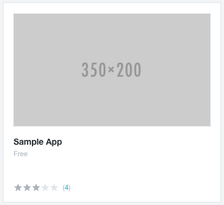
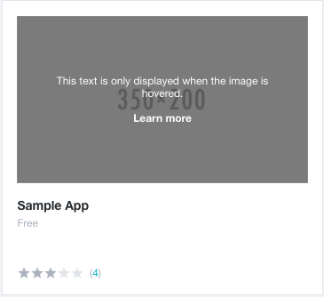
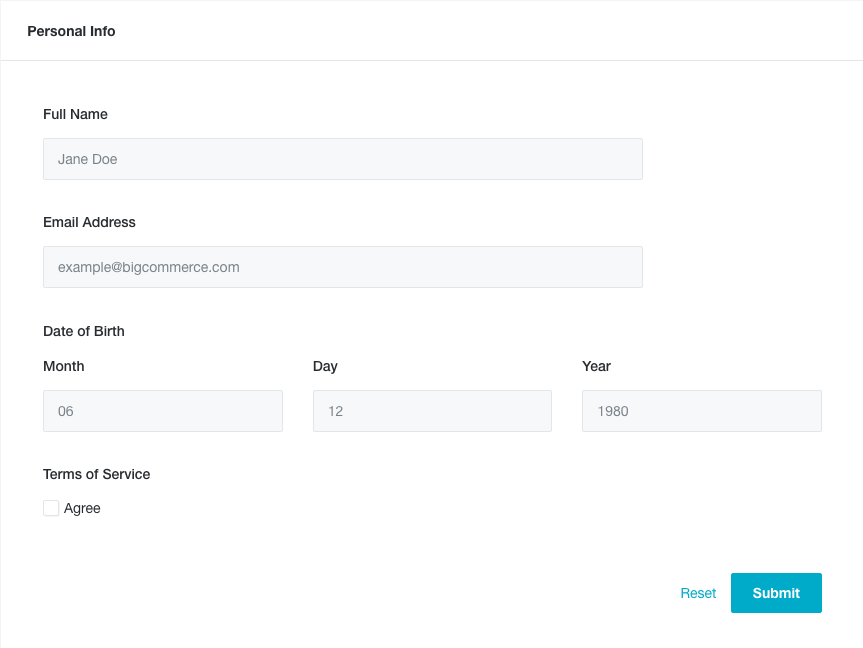
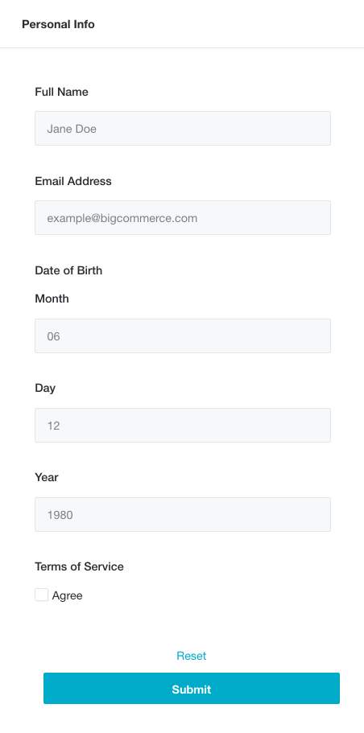
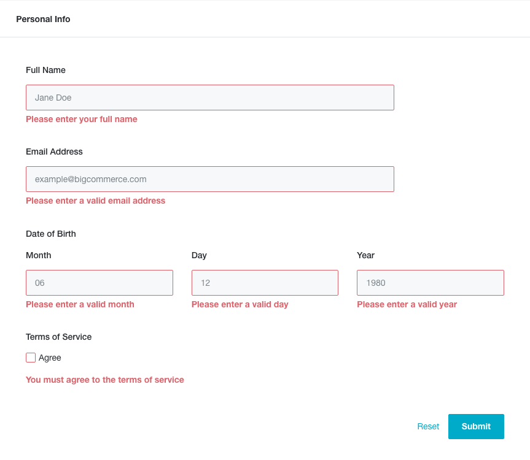

# BigCommerce Frontend Test Instructions

Complete each exercise in its respective folder and include any instructions for viewing the
solutions inside `README.md`. For your convenience, we've included an http server
that can be started by running `npm run serve` (after an `npm install`). 

The exercises should be completed without any CSS frameworks or libraries (such as Bootstrap, Bourbon, Compass etc). If a CSS pre-processor (SASS, LESS, Stylus) helps your process, then we want to see how you utilize those.
You may include any javascript libraries that you feel add value for each exercise. We prefer your solution did not include any major frameworks such as Angular, React, or Ember, because we want to evaluate your javascript/html/css knowledge as a whole, not so much knowledge of a specific framework.
If any of your solution needs to be compiled, please commit the outputted code as part of your submission.

Finally, we will be assessing the solution as if it were an internal pull request. When in 
doubt, think about what level of code quality you would expect when asked for a review.

## Submission

To submit the test, first fork this Github repository. Then, commit and push your changes to your forked repo. Finally, open a pull request from your branch to the original repo (`bigcommerce-test/<your user name>`).

To learn more about basic Github workflow, check out [this guide](https://guides.github.com/activities/forking/).

## Exercise 1: Card

First, use any combination of HTML, CSS, and Javascript to create the card component shown below:

Hover state:

### Card requirements:

- The card component should look as close as possible to the images provided above.
- The card title “Sample App” should take the user to another page when clicked (anywhere is fine).
- When hovering over the image, additional text with a partially transparent background should appear as shown.
- Initially the card should have 3 stars selected. The user should be able to click any star to adjust the rating. 
- Note that the number displayed next to the star rating indicates the number of reviews. For the sake of this exercise, you can leave it hard-coded.

## Exercise 2: Form and AJAX Requests

### Part 1: HTML form with validation

Next, using any combination of HTML, CSS, and Javascript, create the form shown below:

Initial form:  

Mobile:  

Validation errors:  

#### Form requirements:

- The form should be as accessible as possible. Keep keyboard-only users and screen readers in mind.
- The form should not show any error messages until the user has attempted to submit the form.
- The "Full Name" field should not be empty, but no further validation needs to be done.
- The email address field should contain a valid email address.
- The "Date of Birth" fields should comprise a valid date in the past.
- The "Terms of Service" checkbox must be checked in order to pass validation.

### Part 2: Ajax requests

Please implement the following form submission behavior.

#### Requirements:

1. When the form validation passes, do an AJAX `POST` request to "http://www.mocky.io/v2/573283c60f0000f816ead7ac". The request body should be a JSON object comprised of all the form name and values.
1. The ajax response will contain an array of urls. For each one of these urls, do an AJAX `GET` request.
1. Each successful request will respond with a JSON object containing a string. Concatenate the strings in the order they appear in the urls array.
1. Ignore any requests that do not return a 200.
1. Upon completion of all requests, display the concatenated string with `window.alert`.

## Implementation questions
Please answer the following questions in README.md:

- Did you include any JS libraries in any of the above exercises? Why or why not?
- Are there any cross browser compatibility issues? Note any specifics.
- Were there any decisions you had to make when implementing the form field validation? Describe any trade-offs you had to make?
- If you were to ask the UI/UX designer any questions about the above mocks and requirements, what would they be? Is there anything you would call out, or recommend changing?
- What was the most difficult or challenging aspect to implement in the above exercises? Why?
